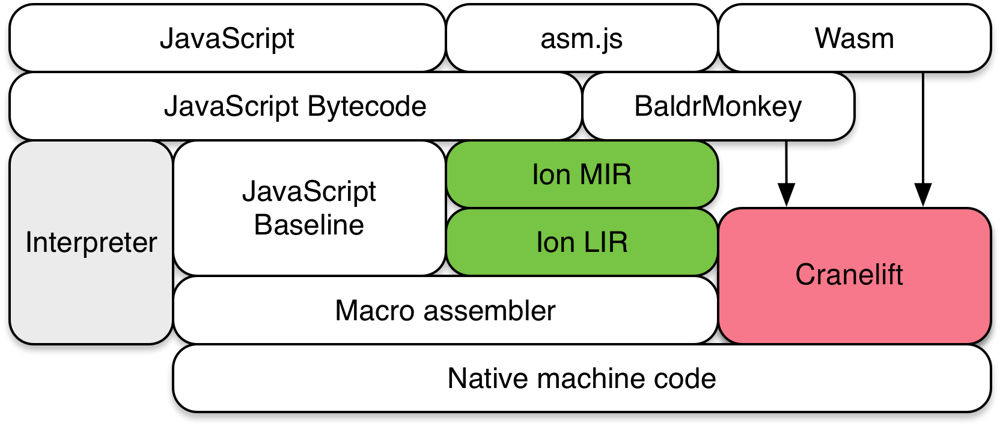
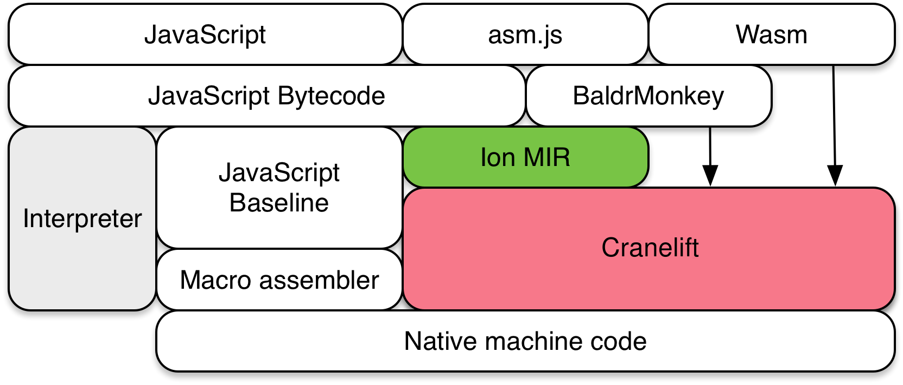

Cranelift in SpiderMonkey
=========================

[SpiderMonkey](https://developer.mozilla.org/en-US/docs/Mozilla/Projects/SpiderMonkey)
is the JavaScript and WebAssembly engine in Firefox. Cranelift is
designed to be used in SpiderMonkey with the goal of enabling better
code generation for ARM's 32-bit and 64-bit architectures, and building
a framework for improved low-level code optimizations in the future.

Phase 1: WebAssembly
--------------------

SpiderMonkey currently has two WebAssembly compilers: The tier 1
baseline compiler (not shown below) and the tier 2 compiler using the
IonMonkey JavaScript compiler's optimizations and register allocation.

In phase 1, Cranelift aims to replace the IonMonkey-based tier 2
compiler for WebAssembly only. It will still be orchestrated by the
BaldrMonkey engine and compile WebAssembly modules on multiple threads.
Cranelift translates binary wasm functions directly into its own
intermediate representation, and it generates binary machine code
without depending on SpiderMonkey's macro assembler.

Phase 2: IonMonkey
------------------

The IonMonkey JIT compiler is designed to compile JavaScript code. It
uses two separate intermediate representations to do that:

 - MIR is used for optimizations that are specific to JavaScript JIT
   compilation. It has good support for JS types and the special tricks
   needed to make JS fast.
 - LIR is used for register allocation.

Cranelift has its own register allocator, so the LIR representation can
be skipped when using Cranelift as a backend for IonMonkey.
