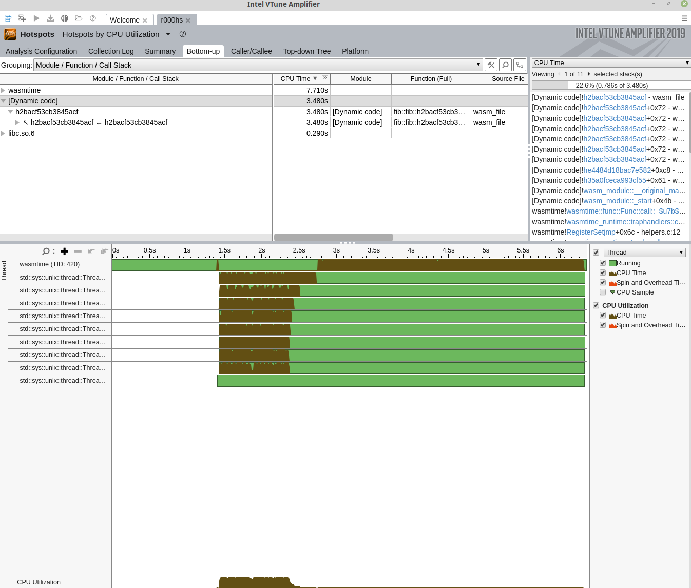

# Using `VTune` on Linux

[`VTune Profiler`](https://software.intel.com/en-us/vtune-help) is a popular performance profiling tool that targets both 32-bit and 64-bit x86 architectures. The tool collects profiling data during runtime and then either through command line or gui, provides a variety of options for viewing and doing anaysis on that data. VTune Profiler is available in both commerical and free options. The free download version backed by a community forum for support, is available [`here`](https://software.intel.com/en-us/vtune/choose-download#standalone). This version is appropriate for detailed analysis of your WASM program. Note for jit support, Wasmtime only supports VTune profiling on linux platforms but other platforms are expected to be enabled in the future.

VTune support in wasmtime is provided through the jit profiling APIs at [`https://github.com/intel/ittapi`](https://github.com/intel/ittapi). These APIs are provided for code generators (or the runtimes that use them) to report jit activities. These APIs are implemented in a shared library (built from the same [`ittapi`](https://github.com/intel/ittapi) project) which wasmtime pulls in and links to when vtune support is specified through the `vtune` cargo feature flag. This feature is not enabled by default. When the VTune collector is run, it links to this same shared library to handle profiling request related to the reported jit activities. Specifically, Wasmtime pulls in the ittapi-rs system crate which provides the shared library and Rust interface to the jit profiling APIs.

For jit profiling with VTune Profiler, first you want to make sure the `vtune` feature is enabled. After that, enabling runtime support is based on how you are using Wasmtime:

* **Rust API** - you'll want to call the [`Config::profiler`] method with
  `ProfilingStrategy::VTune` to enable profiling of your wasm modules.

* **C API** - you'll want to call the `wasmtime_config_profiler_set` API with a
  `WASMTIME_PROFILING_STRATEGY_VTUNE` value.

* **Command Line** - you'll want to pass the `--vtune` flag on the command
  line.

After profiling is complete, a results folder will hold profiling data that can then be read and analyzed with VTune.

Also note, VTune is capable of profiling a single process or system wide. As such, and like perf, VTune is plenty capable of profiling the wasmtime runtime itself without any added support. However, APIs [`here`](https://github.com/intel/ittapi) also support an interface for marking the start and stop of code regions for easy isolatation in the VTune Profiler. Support for these APIs are expected to be added in the future.

Take the following example: with VTune properly installed, if you're using the CLI you'll execute with:

```sh
$ cargo build --features=vtune
$ amplxe-cl -run-pass-thru=--no-altstack -collect hotspots target/debug/wasmtime --vtune foo.wasm
```

This command tells the VTune collector (amplxe-cl) to collect hotspot profiling data on wasmtime that is executing foo.wasm. The --vtune flag enables VTune support in wasmtime so that the collector is also alerted to jit events that take place during runtime. The first time this is run, the result of the command is a results diretory r000hs/ which contains hotspot profiling data for wasmtime and the execution of foo.wasm. This data can then be read and displayed via the command line or via the VTune gui by importing the result.

### `VTune` example

Running through a familiar algorithm, first we'll start with the following wasm:

```rust
fn main() {
    let n = 45;
    println!("fib({}) = {}", n, fib(n));
}

fn fib(n: u32) -> u32 {
    if n <= 2 {
        1
    } else {
        fib(n - 1) + fib(n - 2)
    }
}
```

Profiling data using vtune can be collected a number of ways and profiling data can be collected to focus
on certain types of analysis. Below we show a command line executable option using amplxe-cl, which is
installed and in our path, to help find hotspots in our wasm module. To collect  profiling information then,
we'll simply execute:

```sh
$ rustc --target wasm32-wasi fib.rs -C opt-level=z -C lto=yes
$ amplxe-cl -run-pass-thru=--no-altstack -v -collect hotspots target/debug/wasmtime --vtune fib.wasm
fib(45) = 1134903170
amplxe: Collection stopped.
amplxe: Using result path /home/jlb6740/wasmtime/r000hs
amplxe: Executing actions  7 % Clearing the database
amplxe: The database has been cleared, elapsed time is 0.239 seconds.
amplxe: Executing actions 14 % Updating precomputed scalar metrics
amplxe: Raw data has been loaded to the database, elapsed time is 0.792 seconds.
amplxe: Executing actions 19 % Processing profile metrics and debug information
...
...
Top Hotspots
Function                                                                                      Module          CPU Time
--------------------------------------------------------------------------------------------  --------------  --------
h2bacf53cb3845acf                                                                             [Dynamic code]    3.480s
__memmove_avx_unaligned_erms                                                                  libc.so.6         0.222s
cranelift_codegen::ir::instructions::InstructionData::opcode::hee6f5b6a72fc684e               wasmtime          0.122s
core::ptr::slice_from_raw_parts::hc5cb6f1b39a0e7a1                                            wasmtime          0.066s
_$LT$usize$u20$as$u20$core..slice..SliceIndex$LT$$u5b$T$u5d$$GT$$GT$::get::h70c7f142eeeee8bd  wasmtime          0.066s
```
Note again, wasmtime must be built with the `vtune` feature flag enabled. From here you there are several options for further analysis. Below is an example view of the collected as seen in VTune's gui with it's many options.



For more information on VTune and the analysis tools it provides see the docs [`here`](https://software.intel.com/en-us/vtune-help).